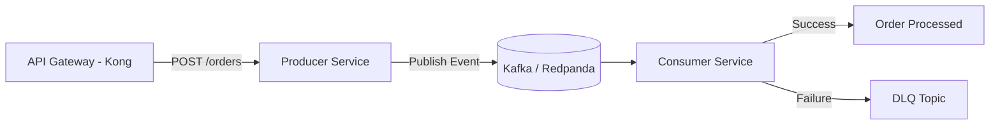

# Middleware Integration Demo

A lightweight but enterprise‑grade **event‑driven integration system** demonstrating API gateway routing, Kafka‑based messaging, producer/consumer microservices, DLQ handling, and cloud‑native packaging using Docker.  
Designed as a showcase of middleware, integration patterns, and distributed system engineering.

---

## 📌 Overview

This project simulates a real-world middleware integration flow commonly found in enterprise platforms. It includes:

- **API Gateway (Kong)** for routing and request mediation  
- **Producer Service** that receives API calls and publishes events  
- **Kafka / Redpanda** as the event backbone  
- **Consumer Service** that processes events  
- **DLQ (Dead Letter Queue)** for failed message handling  
- **Retry logic** for transient failures  
- **Docker Compose orchestration** for local, free deployment  
- **Architecture diagrams & sequence flows** for clarity  

This project is intentionally designed to be **simple to run locally**, yet **architecturally rich** enough to demonstrate real integration expertise.

---

## 🎯 Goals of This Project

This demo highlights your ability to design and implement:

- Event-driven architecture  
- Middleware patterns (gateway → topic → consumer)  
- Reliable message processing (retry + DLQ)  
- API gateway configuration  
- Microservice communication  
- Cloud-native packaging (Docker)  
- Enterprise documentation (architecture, sequence diagrams, ADRs)  

---

## 🏗️ Architecture

### System Overview



## Dependencies and Prerequisites

Install the following before running the demo locally:

- **Git** for cloning the repository.
- **Java Development Kit (JDK) 21**. Both services target Java 21.
- **Apache Maven 3.9 or newer** to build and test the services. Maven must be available as `mvn` on `PATH`.
- **Docker Desktop** with Docker Compose support. Docker runs Redpanda and Kong, and is required for the container deployment path.
- **curl** for the API smoke test and the included scripts. Git Bash, WSL, or another POSIX-compatible shell is recommended for the shell scripts.

Verify the required tools:

```bash
java -version
mvn -version
docker --version
docker compose version
curl --version
```

The application dependencies are downloaded automatically by Maven from the project POM files:

- Spring Boot `3.4.4`
- Spring Web in the producer service
- Spring Boot JSON in the consumer service
- Spring Kafka in both services
- Redpanda `v24.3.9` as the local Kafka-compatible broker
- Kong `3.9` as the API gateway

## Build and Test

Run these commands from the repository root. Each service is an independent Maven project.

```bash
cd producer
mvn clean verify

cd ../consumer
mvn clean verify

cd ..
```

`mvn verify` compiles the service and runs its tests. The current scaffold has no application tests yet, so the command primarily verifies compilation and packaging.

## Local Deployment with Docker

### 1. Start Redpanda and create topics

```bash
docker compose -f kafka/docker-compose.yaml up -d
docker compose -f kafka/docker-compose.yaml ps
```

The broker is available from the host at `localhost:19092`. The Compose setup creates the `orders` and `orders.dlq` topics. Containers on the Compose network use `redpanda:9092`.

### 2. Build the service images

```bash
docker build -t middleware-producer ./producer
docker build -t middleware-consumer ./consumer
```

### 3. Start producer and consumer

The commands below use the Compose network created by the Kafka stack so the services can resolve `redpanda` and each other by container name:

```bash
docker run -d --name middleware-producer \
    --network kafka_default \
    -p 8081:8081 \
    -e KAFKA_BOOTSTRAP_SERVERS=redpanda:9092 \
    middleware-producer

docker run -d --name middleware-consumer \
    --network kafka_default \
    -p 8082:8082 \
    -e KAFKA_BOOTSTRAP_SERVERS=redpanda:9092 \
    middleware-consumer
```

### 4. Start Kong

Build and run the gateway on the same Docker network. The declarative configuration routes `POST /orders` to the producer container.

```bash
docker build -t middleware-gateway ./gateway

docker run -d --name middleware-gateway \
    --network kafka_default \
    -p 8000:8000 \
    -p 8443:8443 \
    middleware-gateway
```

### 5. Send a test order

```bash
curl --fail-with-body --request POST \
    --url http://localhost:8000/orders \
    --header 'Content-Type: application/json' \
    --data '{"customerId":"demo-customer","amount":42.50}'
```

The response should be `202 Accepted`. The consumer logs the processed event:

```bash
docker logs -f middleware-consumer
```

You can also use the included scripts:

```bash
./scripts/publish.sh
REQUESTS=100 ./scripts/load-test.sh
```

Set `GATEWAY_URL` to target another gateway address, for example `GATEWAY_URL=http://localhost:8000`.

## Stop the Local Environment

```bash
docker rm -f middleware-gateway middleware-producer middleware-consumer
docker compose -f kafka/docker-compose.yaml down
```

Add `-v` to the final command if you also want to remove Docker volumes created by the Kafka stack.

## Development Mode Without Service Containers

For faster iteration, run Redpanda and Kong with Docker and launch the Spring Boot services from separate terminals:

```bash
docker compose -f kafka/docker-compose.yaml up -d

cd producer
mvn spring-boot:run
```

In another terminal:

```bash
cd consumer
mvn spring-boot:run
```

The default service configuration connects to the host broker at `localhost:19092`. In this mode, Kong must be configured to reach the host services, or the request can be sent directly to `http://localhost:8081/orders`.
