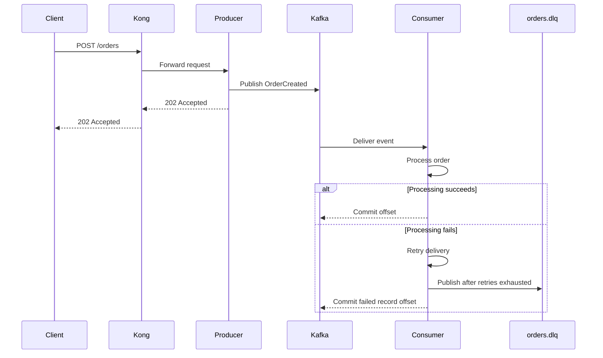

# Order Event Sequence

```mermaid
sequenceDiagram
    participant Client
    participant Kong
    participant Producer
    participant Kafka
    participant Consumer
    participant DLQ as orders.dlq

    Client->>Kong: POST /orders
    Kong->>Producer: Forward request
    Producer->>Kafka: Publish OrderCreated
    Producer-->>Kong: 202 Accepted
    Kong-->>Client: 202 Accepted
    Kafka->>Consumer: Deliver event
    Consumer->>Consumer: Process order
    alt Processing succeeds
        Consumer-->>Kafka: Commit offset
    else Processing fails
        Consumer->>Consumer: Retry delivery
        Consumer->>DLQ: Publish after retries exhausted
        Consumer-->>Kafka: Commit failed record offset
    end
```